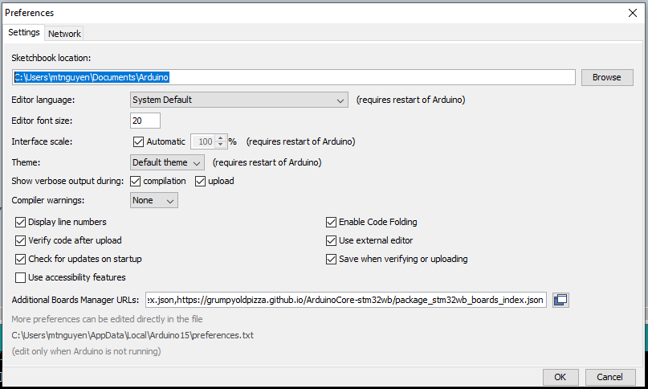
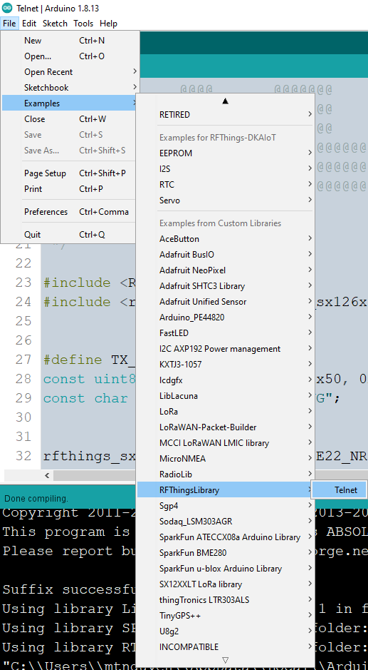
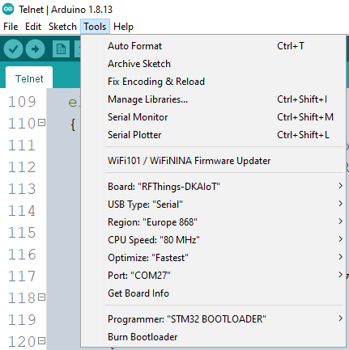

# RFThings Libary

## Installation
1. Download and install the [Arduino IDE](https://www.arduino.cc/en/Main/Software)
2. Install [Arduino Core for RFThings STM32L4 based boards](https://github.com/RFThings/rfthings-stm32l4)
3. Install RFThings library from this repository
- <b><u>Method 1</u></b> (<i>Recommeded</i>): Download the repository as <b>*.zip</b> file and add into Arduino IDE
- <b><u>Method 2</u></b>: Clone the repository directly into your Arduino Library folder. The path to your Arduino Library folder is indicated as <i>Sketchbook location</i> in <b>Preferences menu</b> (<i>Alt + ,</i>)


4. Get started with the Telnet example in <b>File -> Examples -> RFThingsLibrary -> Telnet</b>


5. Select the <b>RFThings-DKAIoT</b> Board in Tools menu and upload the example.


## Telnet Example
### Sketch configurations

```
#define TX_INTERVAL 5 // seconds
const uint8_t device_uid[] = { 0x50, 0xFF, 0x1A, 0x01 };
const char ping_message[] = "PING";
```

| Name | Description |
| :---: | :---: |
| <b>TX_INTERVAL</b> | The number of second between two sendings |
| <b>device_uid</b> | The 4-byte array of Device UID |
| <b>ping_message</b> | The char array of the uplink message (maximum 4 bytes) |

### LoRa Packet Params
```
sx126x_pkt_params_lora_t lora_packet_param;
lora_packet_param.preamble_len_in_symb = 8;
lora_packet_param.header_type = SX126X_LORA_PKT_EXPLICIT;
lora_packet_param.pld_len_in_bytes = 255;
lora_packet_param.crc_is_on = true;
lora_packet_param.invert_iq_is_on = false;
sx126x.set_lora_pkt_param(lora_packet_param);
```

| Name | Types | Description |
| :---: | :---: | :----------: |
| preamble_len_in_symb | <i>uint16_t</i> | Number of symbols sent as preamble (1 - 65535) |

| Name | Values | Description |
| :----------: | :----------: | :----------: |
| header_type | <b>SX126X_LORA_PKT_EXPLICIT</b> | Variable length packet (Explicit header) |
| header_type | <b>SX126X_LORA_PKT_IMPLICIT</b> | Fixed length packet (Implicit header) |

| Name | Types | Description |
| :---: | :---: | :----------: |
| pld_len_in_bytes | <i>uint8_t</i> | Size of the payload (in bytes) to transmit or maximum size of the payload that the receiver can accept (0 - 255) |

| Name | Types | Description |
| :---: | :---: | :----------: |
| crc_is_on | <i>boolean</i> | Enable CRC |

| Name | Types | Description |
| :---: | :---: | :----------: |
| invert_iq_is_on | <i>boolean</i> | Enable Inverted IQ setup |

### LoRa Module Configurations

```
sx126x.set_tx_power(21);
sx126x.set_frequency(868300000);
sx126x.set_spreading_factor(RFT_LORA_SPREADING_FACTOR_9);
sx126x.set_bandwidth(RFT_LORA_BANDWIDTH_250KHZ);
sx126x.set_coding_rate(RFT_LORA_CODING_RATE_4_5);
sx126x.set_syncword(RFT_LORA_SYNCWORD_PRIVATE);
```

| Function name | Parameter | Description |
| :---: | :---: | :----------: |
| set_tx_power() | <i>int8_t</i> tx_power | Set transmit power in dBm (-17 to 22) |
| set_frequency() | <i>uint32_t</i> frequency | Set transmit frequency in Hz |

| Function name | Values | Description |
| :---: | :---: | :----------: |
| set_spreading_factor() | <b>RFT_LORA_SPREADING_FACTOR_5</b> | Spreading Factor 5 |
| set_spreading_factor() | <b>RFT_LORA_SPREADING_FACTOR_6</b> | Spreading Factor 6 |
| set_spreading_factor() | <b>RFT_LORA_SPREADING_FACTOR_7</b> | Spreading Factor 7 |
| set_spreading_factor() | <b>RFT_LORA_SPREADING_FACTOR_8</b> | Spreading Factor 8 |
| set_spreading_factor() | <b>RFT_LORA_SPREADING_FACTOR_9</b> | Spreading Factor 9 |
| set_spreading_factor() | <b>RFT_LORA_SPREADING_FACTOR_10</b> | Spreading Factor 10 |
| set_spreading_factor() | <b>RFT_LORA_SPREADING_FACTOR_11</b> | Spreading Factor 11 |
| set_spreading_factor() | <b>RFT_LORA_SPREADING_FACTOR_12</b> | Spreading Factor 12 |

| Function name | Values | Description |
| :---: | :---: | :----------: |
| set_bandwidth() | <b>RFT_LORA_BANDWIDTH_10KHZ</b> | Bandwidth 10 kHz |
| set_bandwidth() | <b>RFT_LORA_BANDWIDTH_15KHZ</b> | Bandwidth 15 kHz |
| set_bandwidth() | <b>RFT_LORA_BANDWIDTH_20KHZ</b> | Bandwidth 20 kHz |
| set_bandwidth() | <b>RFT_LORA_BANDWIDTH_31KHZ</b> | Bandwidth 31 kHz |
| set_bandwidth() | <b>RFT_LORA_BANDWIDTH_41KHZ</b> | Bandwidth 41 kHz |
| set_bandwidth() | <b>RFT_LORA_BANDWIDTH_62KHZ</b> | Bandwidth 62.5 kHz |
| set_bandwidth() | <b>RFT_LORA_BANDWIDTH_125KHZ</b> | Bandwidth 125 kHz |
| set_bandwidth() | <b>RFT_LORA_BANDWIDTH_250KHZ</b> | Bandwidth 250 kHz |
| set_bandwidth() | <b>RFT_LORA_BANDWIDTH_500KHZ</b> | Bandwidth 500 kHz |

| Function name | Values | Description |
| :---: | :---: | :----------: |
| set_coding_rate() | <b>RFT_LORA_CODING_RATE_4_5</b> | Coding Rate 4/5 |
| set_coding_rate() | <b>RFT_LORA_CODING_RATE_4_6</b> | Coding Rate 4/6 |
| set_coding_rate() | <b>RFT_LORA_CODING_RATE_4_7</b> | Coding Rate 4/7 |
| set_coding_rate() | <b>RFT_LORA_CODING_RATE_4_8</b> | Coding Rate 4/8 |

| Function name | Values | Description |
| :---: | :---: | :----------: |
| set_syncword() | <b>RFT_LORA_SYNCWORD_PRIVATE</b> | Private Network Syncword |
| set_syncword() | <b>RFT_LORA_SYNCWORD_PUBLIC</b> | Public Network Syncword |
